# Flujo de la página web

El siguiente documento contiene las capturas de pantallas de la página web. 

**Homepage:**
Un página que recibe al usuario con botones "Call to action". 

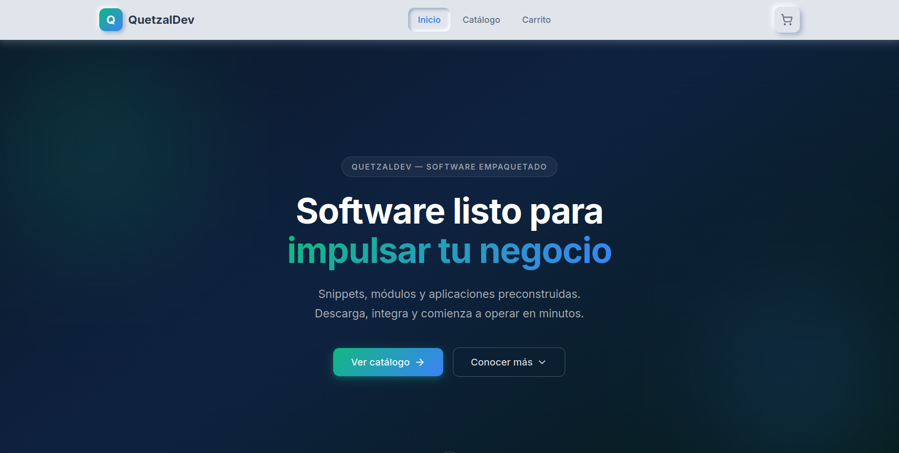

Diferenciación ante competidores:

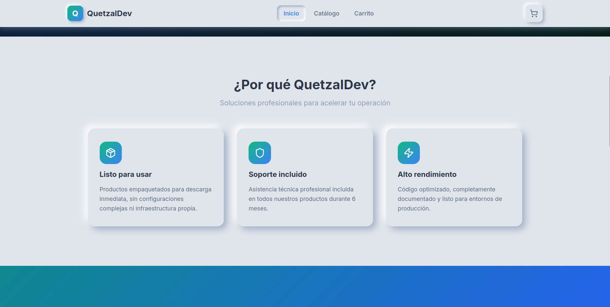

Muestra de nuestros productos:

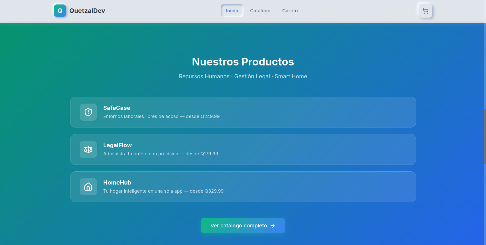

Muestra de KPI`s del sistema:

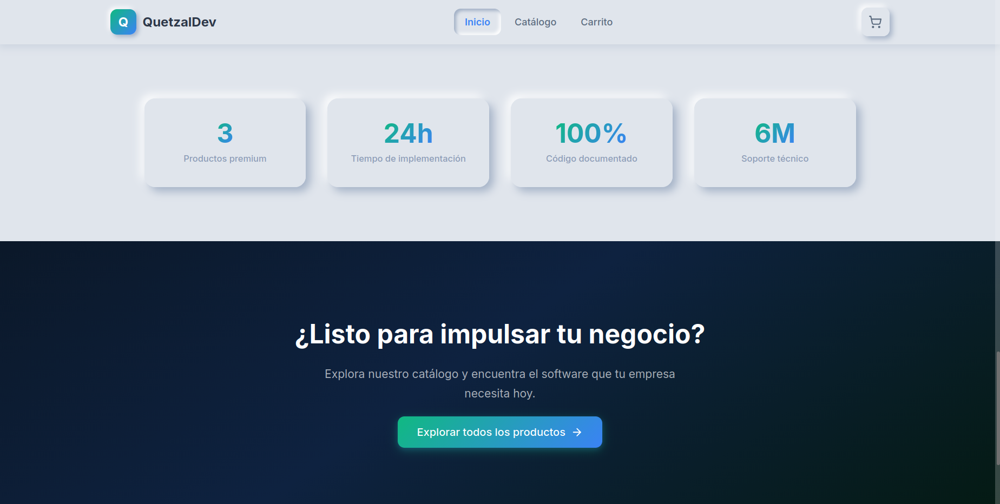

**Catalogo:**

Muestra de nuestros productos:
- Imagen
- Descripcion
- Funciones
- Beneficios

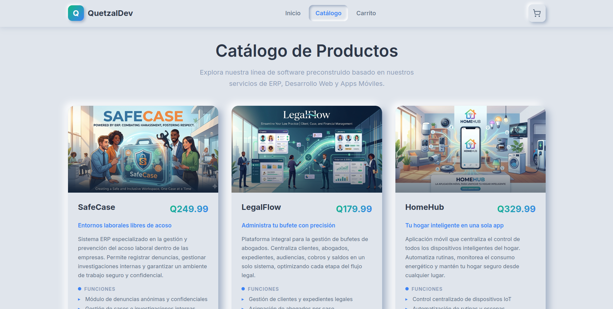

Opción para agregar productos al carrito

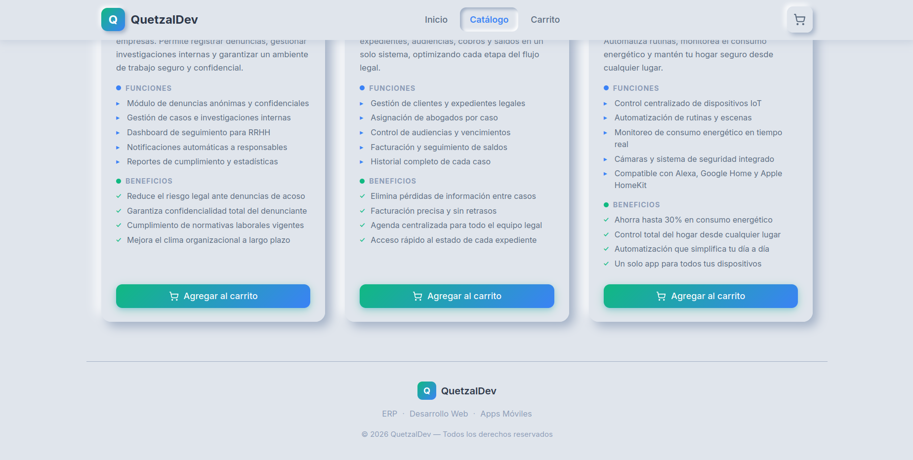

**Carrito:**

Podemos agregar los productos y manejar la cantidad de compra

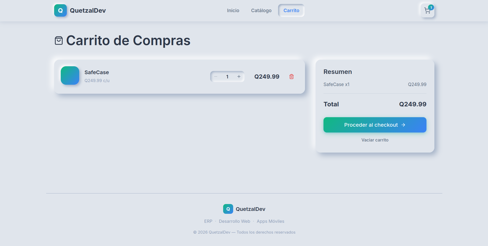

**Checkout:**

El usuario llena sus datos para finalizar el proceso

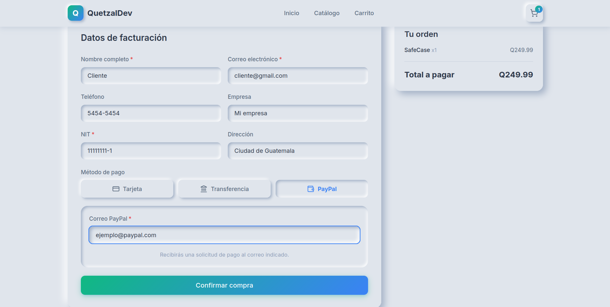

**Comprobante:**

Al finalizar el la compra se muestra un comprobante:

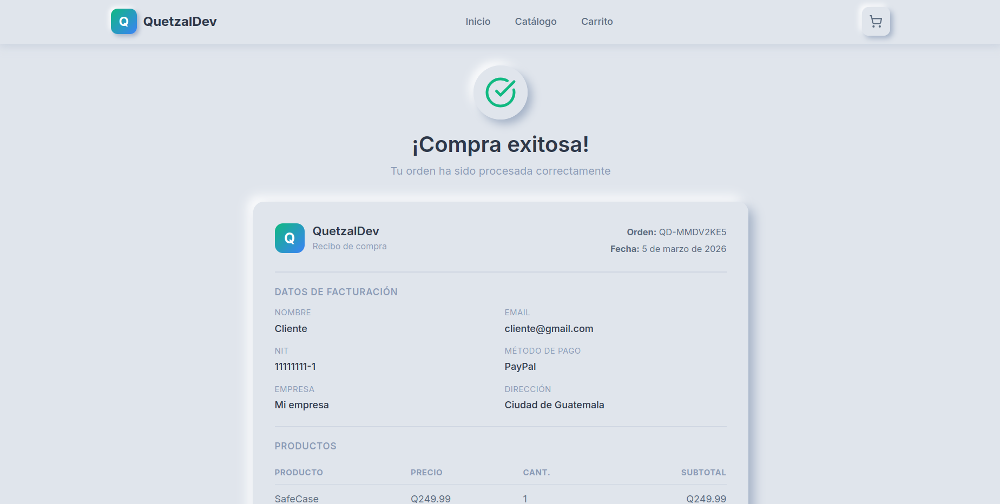

Se genera un link al producto:

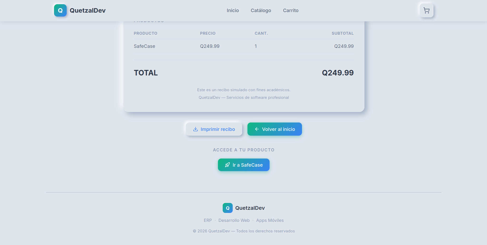

**Vista del producto:**

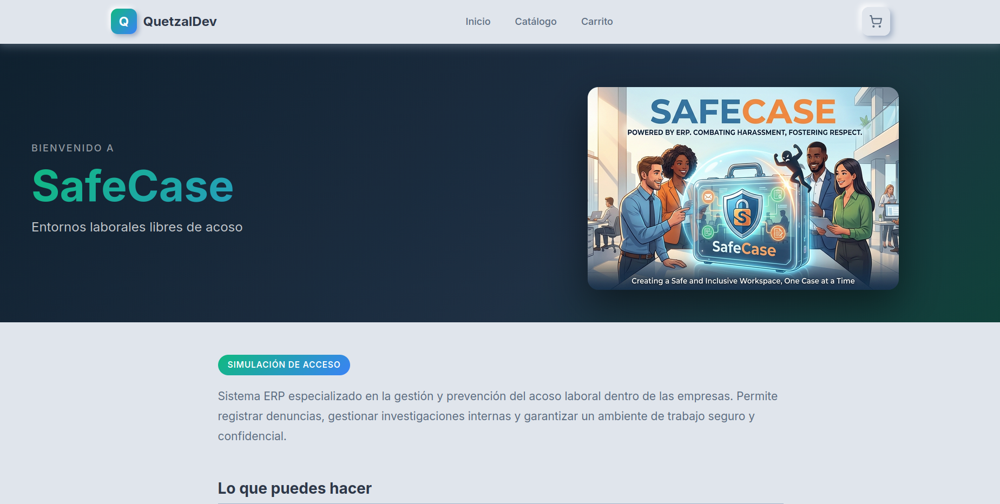