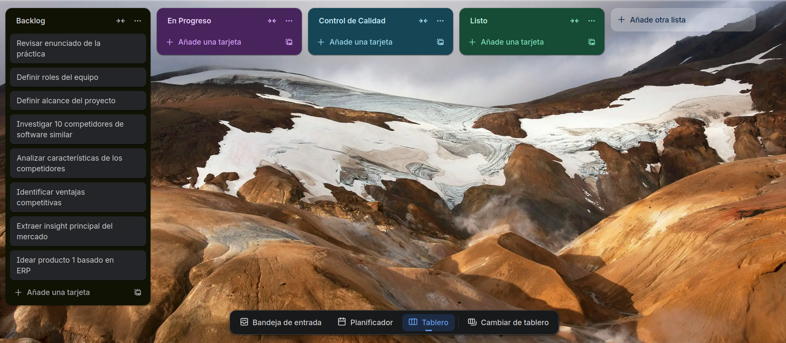
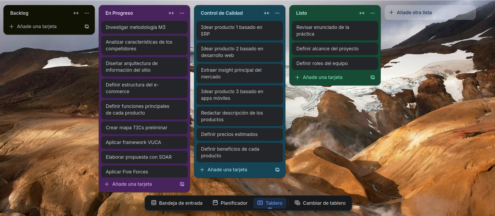
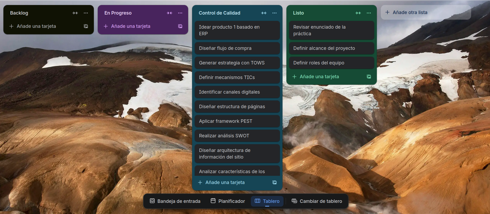
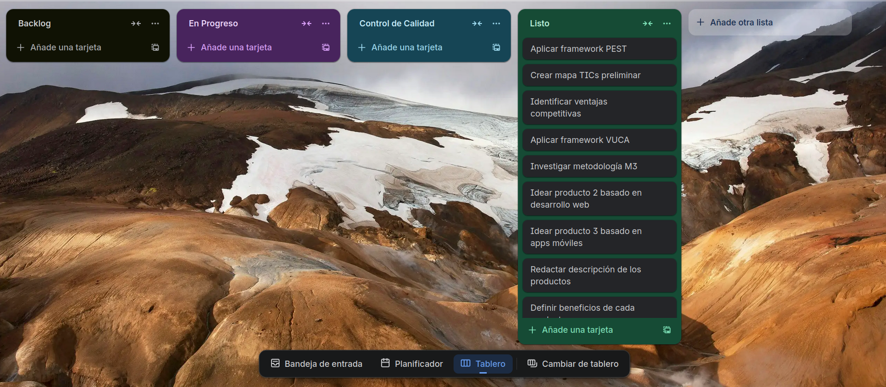

# Sprint 1

**Objetivo:**

Construir la base conceptual del proyecto antes del desarrollo, definiendo el alcance, los productos, el análisis competitivo, los marcos estratégicos y la estructura inicial del e-commerce.

## Descripción del Sprint

El Sprint 1 estuvo orientado a actividades de análisis, estructuración y definición del proyecto. En esta fase el equipo no se enfocó en desarrollar páginas del sitio, sino en establecer los fundamentos estratégicos y funcionales sobre los que posteriormente se construiría la plataforma e-commerce de QuetzalDev.

Durante este sprint se trabajaron cinco frentes principales:

### 1. Organización inicial del proyecto

- Revisar el enunciado de la práctica.
- Definir los roles del equipo.
- Delimitar el alcance del proyecto.

### 2. Investigación de mercado y competencia

- Investigar 10 competidores de software similar.
- Analizar las características de los competidores.
- Identificar ventajas competitivas para QuetzalDev.
- Extraer el insight principal del mercado.

### 3. Definición de la oferta de productos

- Idear el producto 1 basado en ERP.
- Idear el producto 2 basado en desarrollo web.
- Idear el producto 3 basado en apps móviles.
- Redactar la descripción de los productos.
- Definir precios estimados.
- Definir beneficios de cada producto.
- Definir las funciones principales de cada producto.

### 4. Arquitectura y planteamiento del e-commerce

- Definir la estructura del e-commerce.
- Diseñar la arquitectura de información del sitio.
- Diseñar la estructura de páginas.
- Diseñar el flujo de compra.

### 5. Mapeo TIC y análisis estratégico

- Investigar la metodología M3.
- Crear un mapa TICs preliminar.
- Definir mecanismos TICs.
- Identificar canales digitales.
- Aplicar framework VUCA.
- Aplicar framework PEST.
- Aplicar Five Forces.
- Realizar análisis SWOT.
- Generar estrategia con TOWS.
- Elaborar propuesta con SOAR.

## Resultado Esperado

Al cierre del Sprint 1, el equipo debía contar con una definición clara del negocio digital de QuetzalDev: productos propuestos, justificación estratégica, visión del mercado, arquitectura preliminar del sitio y mapa TIC inicial. Este sprint construyó el qué y el por qué del proyecto.

Definición del Sprint Backlog:

En el backlog inicial se observa que las tareas se concentraron en la comprensión del problema, la investigación de competidores, la identificación de ventajas competitivas y la ideación del primer producto con base en ERP. Esto confirma que el sprint comenzó con actividades de levantamiento y definición.

Primer avance:

En el primer avance ya se aprecia trabajo activo en la investigación de la metodología M3, el análisis de competidores, la arquitectura de información del sitio, la definición del e-commerce, las funciones principales de cada producto y la aplicación de frameworks estratégicos como VUCA, Five Forces y SOAR.

Segundo Avance:

En la fase de control de calidad del sprint se revisaron tareas relacionadas con la definición de los tres productos, la redacción de sus descripciones, la fijación de precios estimados, la definición de beneficios y la obtención del insight principal del mercado. Esto evidencia que el equipo validó primero el contenido conceptual antes de pasar a la implementación técnica.

Final del sprint:

Al final del sprint quedaron completadas las tareas base de entendimiento del proyecto, entre ellas la revisión del enunciado, la definición del alcance, la definición de roles del equipo, la investigación de la metodología M3, la creación del mapa TICs preliminar, la aplicación de PEST y VUCA, así como la ideación de productos basados en desarrollo web y apps móviles. El resultado fue un marco estratégico sólido para iniciar el desarrollo del sitio en el siguiente sprint.